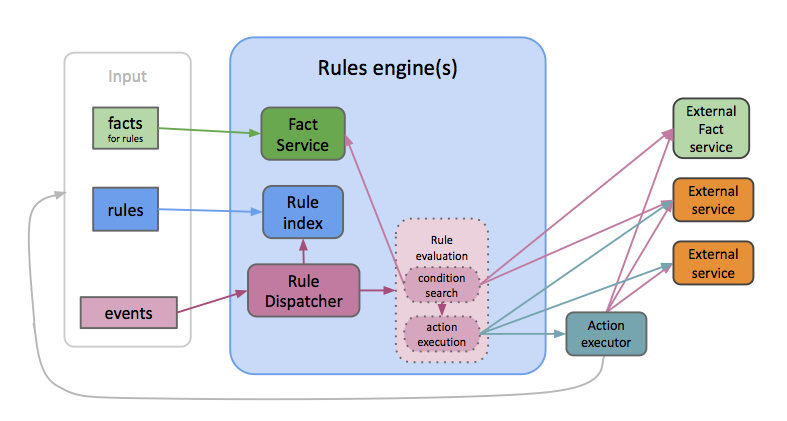

<!--

Copyright 2015 Comcast Cable Communications Management, LLC

Licensed under the Apache License, Version 2.0 (the "License");
you may not use this file except in compliance with the License.
You may obtain a copy of the License at

  http://www.apache.org/licenses/LICENSE-2.0

Unless required by applicable law or agreed to in writing, software
distributed under the License is distributed on an "AS IS" BASIS,
WITHOUT WARRANTIES OR CONDITIONS OF ANY KIND, either express or implied.
See the License for the specific language governing permissions and
limitations under the License.

End Copyright -->

# Rules Core Manual

2016-06-23T17:59:44+00:00

1. [Introduction](#introduction)
1. [Fundamental concepts](#fundamental-concepts)
1. [Basic concepts](#basic-concepts)
  1. [Locations](#locations)
  1. [Facts](#facts)
  1. [Events](#events)
  1. [Patterns](#patterns)
  1. [Rules](#rules)
    1. [Scheduled rules](#scheduled-rules)
    1. [Conditions](#conditions)
    1. [Actions](#actions)
    1. [In-process Javascript Actions](#in-process-javascript-actions)
    1. [Action executors](#action-executors)
  1. [Parent locations](#parent-locations)
    1. [Location-specific location cache TTL](#location-specific-location-cache-ttl)
1. [Event processing](#event-processing)
  1. [Goals](#goals)
  1. [Summary](#summary)
  1. [Discussion](#discussion)
1. [Matching](#matching)
  1. [Matching Examples](#matching-examples)
    1. [Matching Limitations](#matching-limitations)
    1. [Matching Background](#matching-background)
  1. [External fact services](#external-fact-services)
    1. [HTTP Fact service protocol](#http-fact-service-protocol)
    1. [Fact service examples](#fact-service-examples)
  1. [Action requests](#action-requests)
    1. [Action Executor protocol](#action-executor-protocol)
1. [API Summary](#api-summary)
1. [In-memory state](#in-memory-state)
  1. [Indexed state](#indexed-state)
  1. [Linear state](#linear-state)
  1. [State caching](#state-caching)
1. [Persistence](#persistence)
  1. [In-memory](#in-memory)
  1. [Bolt](#bolt)
  1. [DyanmoDB](#dyanmodb)
  1. [Cassandra](#cassandra)
1. [Routing](#routing)
1. [Embeddeding](#embeddeding)
1. [Engine programming](#engine-programming)
  1. [Basic engine stats](#basic-engine-stats)
  1. [Timers](#timers)
  1. [Engine Locations](#engine-locations)
1. [Tricks](#tricks)
  1. [Checking that an action was triggered](#checking-that-an-action-was-triggered)
  1. [Event with one-shot rule](#event-with-one-shot-rule)
  1. [Functional event processing](#functional-event-processing)

## Introduction

This system is an event processor based on pattern matching, condition
evaluation, and arbitrary actions.  When an event arrives, the system
looks for matching rules.  Each matching rule is evaluated, and that
evaluation can execute arbitrary actions, which usually include making
requests to external systems.

The core system consists of a few libraries and an example engine
process that provides a basic HTTP API.



To use a this rules stuff, you'll need to write some rules.  Then send
events.  When an event arrives, the system finds candidate rules and
evaluates them.

A candidate rule for an [event](#events) is a [rule](#rules) that has
a `when` condition that [matches](#matching) the event.

Each candidate rule's `condition` is evaluated to find zero or more
sets of variable bindings.  The condition can query
[external fact services](#external-fact-services) as well as state
that is maintained locally.  We call such state *facts*.  Rules can
write [facts](#facts), an external system can write them, or an
external system can provide them on demand in response to queries.

For each set of variable bindings, the rule's [actions](#actions) are
executed.  In some cases, an external
[action executor](#action-executors) performs the actual action
execution.  This protocol allows actions to be arbitrary and very
application-specific.  Alternately, a Javascript action can be
executed in-process, and that Javascript can also make arbitrary HTTP
requests.

Each event is submitted to a single [logical location](#locations),
such as a customer acccount, and each rule and fact is associated with
zero or more logical locations.  This design enables sophisticated
event routing, scalability, efficient access control, resource
management, and other features.

If you just want to see the primitive API that this repo provides,
look [here](api/rules-core-http-api.md) (and in that directory in
general).

We also have many examples.  See the directory `examples/`.  The
top-level `README.md` is a good place to start.


## Fundamental concepts

## Basic concepts

### Locations

Always sending all messages to all engine processes doesn't scale.  At
some point, a horizontally scalable system must choose a small subset
of nodes to receive at least some given messages.  We embrace that
locality requirement throughout the system.

The system partitions state into separate "locations".  A user account
could be a location.  An apartment building, geographic area, or an
organization could also be locations.  The core system itself provides
no facilities that relate locations or that route messages based on
location.  (We have internal projects that do such routing, but we
have not yet released any as open source.)

Each fact or rule is stored in one or more locations, and each event
is sent to one or more logical locations.

### Facts

A location can store *facts* that a rule's condition can query.  A
fact is map (perhaps with deep structure).  Rendered as JSON:

```Javascript
{"person": "homer",
 "likes": ["beer" "pie"],
 "at": {"type": "residence", "address": "742 Evergreen Terrace"}}
```

An array represents a set.  Its elements are *unordered*.  See
[Matching](#matching).

Facts either live in [locations](#locations) or in external
[fact services](#external-fact-services), which is just something that
speaks a simple, convenient protocol for requesting and receiving
facts.

A fact that lives in a location is called a *local fact*.

A location's local fact state is not meant to be a general-purpose
database.  Instead, applications should use local facts judiciously:
when rule condition evaluation performance is critical.  As a
guideline, perhaps only rules should access facts.

Locations facts can expire.  Put `expires` in UNIX_SECONDS or a string
in RFC3339 syntax in your fact.  (The API `/nowsecs` will tell you
what time an engine thinks it is.)  For clarification: `expires` is an
absolute time, not a delta.  Alternately, you can specify a `ttl`,
which should be a string in Go
[`ParseDuration` syntax](http://golang.org/pkg/time/#ParseDuration).

A fact can be marked to be deleted when another fact is deleted.
Include the property `deleteWith` with an array value that contains
the id of the fact on which this fact depends.  When a fact _f1_ in
another fact _f2_'s `deleteWith` is deleted, fact _f2_ will also be
deleted.  For example, the fact `{"likes":"tacos",
"deleteWith":["homer"]}}` will be deleted when another fact with id
`homer` is deleted.  Note that a rule is a fact, so a rule can have a
functionality `deleteWith` property.

### Events

An event has the same form as a [fact](#facts), but an event is not
(automatically) stored anywhere.  Instead, events are used solely to
trigger rules.

Example

```Javascript
{"who":"homer",
 "arrived":"home",
 "at":"2015-02-24T12:34:45.123Z"}
```

Note that this core system engine isn't really event processing system
along the lines of [Storm](http://storm.apache.org/) and similar
distributed systems.  Instead, with a single engine process, you
simply call an API with an event (and location) as input, and the
processing at this level is synchronous.  You get a result
immediately.  Nothing distributed is going on at this level.  However,
an engine itself is a reasonable component in a larger event
processing system that worries about "at least once" semantics and so
forth.

### Patterns

A *pattern* is a map (perhaps with deep structure) that contains some
strings that start with a `?`.  Example:

```Javascript
{"person": "homer",
 "likes": "?here",
 "at": {"type": "residence", "address": "?address"}}
```

A string that starts with a `?` is a variable.

Pattern matching is a fundamental operation.  An [event](#events) or
[fact](#facts) can be matched against a pattern to obtain zero or more
variable bindings.

As an example, the pattern

```Javascript
{"a":{"b":"?x","c":"?y"},"d":"?y"}
```

matches

```Javascript
{"a":{"b":1,"c":2},"d":2}
```

with a set of bindings

```Javascript
[{"?x":1,"?y":2}]
```

A set of bindings is a map that maps variables to values that, when
applied to pattern, result in a literal subset match (see below).

Check out the [matching details](#matching) for more information.

### Rules

A rule is a structure that typically has a `when` clause, a
[condition](#conditions) and an [action](#actions).  The `when` value, if
present, is an event [pattern](#patterns).  As described earlier, when
an event is processed, rules with matching `when` clauses are
evaluated using the bindings that result from the match.

To evaluate a rule, the system then evaluates the rule's condition.
The `condition`, if present, is a [query](#conditions).  The result is
zero or more sets of variable [bindings](#matching).  For each set of
bindings, the rule's action is executed.

When represented in JSON, a rule looks something like:

```Javascript
{"when":{"pattern":{"a":"?x"}},
 "condition":{"and":[{"pattern":{"b":"?x"}},
                     {"pattern":{"c":"?y"}},
                     {"code":"x+y >= 3"}]},
 "action":{"code":"console.log('x = ' + x); console.log('y = ' + y);"}}
```

By default, a rule action's `code` is Javascript.  But
[actions](#actions) can have several forms.  See [actions](#below).

Rules are stored persistently by [location](#locations).  In fact,
rules are just special facts, but rules are indexed in a manner that
allows relatively efficient rule dispatch.

A rule is a (special) fact, so a rule with a `deleteWith` value will
be deleted when any of the specified facts (including rules) are
deleted.


#### Scheduled rules

If a rule has a `schedule` value, that value specifies when the rule
should be evaluated.  The `when` value is ignored in this case.

The schedule syntax can have three forms:

1. A cron schedule string (supposedly in syntax at https://en.wikipedia.org/wiki/Cron#CRON_expression).

2. "!TIME", where TIME is according to [RFC3339](https://www.ietf.org/rfc/rfc3339.txt).

3. "+DURATION", where DURATION is a [Go Duration](http://golang.org/pkg/time/#ParseDuration).  
Examples: "5s" means "5 seconds", "2m" means "2 minutes", and "1h" means "1 hour".

As an example, the following rule will be evaluated in 30 minutes.

```Javascript
{"schedule":"+30m",
 "condition":{"and": [{"person":"homer", "likes":"tacos"}, 
                      {"person":"homer", "drinking":"beer"}]},
 "action":"message('Homer, you should have a beer with your tacos.')"}
```

#### Conditions

A rule can include a `condition` clause, which can query facts and
execute arbitrary code to extend bindings that resulted from the
`when` clause event matching.

A query is a map that specifies a search for facts.  Roughly speaking,
a query consists of fact [patterns](#patterns) along with `and`s,
`or`s, and `not`s.  In addition, a query can include arbitrary
Javascript code to execute for bindings currently under consideration.

Query execution generates a set of bindings that make the query true
by matching the patterns and obtaining true values from code (if any).

Example query:

```Javascript
{"and":[{"pattern":{"b":"?x"}},
        {"pattern":{"c":"?y"}},
        {"code":"x+y >= 3"}]}

```

`{"pattern": PATTERN}`, where `PATTERN` is a [pattern](#patterns) is
query.  An `and` or `or` value should be an array of subqueries.  A
`not` value is a single subquery.

A `code` value is string of Javascript or an array of strings of
Javascript.  When executed, the Javascript environment includes
bindings for all variables that are bound at that point in the query
execution.  In addition, the variables `event`, `location`, and
`ruleId` are bound to the matching event, the current location, and
the matching rule id respectively.

The `code` is evaluated as a block, so the value of the last
expression becomes the value of the code block.  No explicit `return`
is needed or permitted.  If `code` is present, then a `libraries`
property is supported as documented in
[In-process Javascript actions](#in-process-javascript-actions).

If the value returned by the block is truthy, then the condition
evaluation continues.  In addition, if the value returned is an
object, then the set of bindings is extended with those name/value
pairs.  The keys should be the variables without the `?` prefix.

The order of conjuncts in an `and` and disjuncts in an `or` is
important (at least for now).  That order gives the query plan.  As a
result, you can't have a `code` term before you have map terms that
bind all of the variables referenced in the code term.


#### Actions

A rule's action specifies what should happen for each of bindings
that [condition](#conditions) execution finds.  In addition, the
variables `event`, `location` and `ruleId` are bound.

An action is a map that contains at least a value for `code`.  An
action might also specify an `endpoint`.

Many examples at `examples/tour.sh` and `examples/actions.sh`.

If `endpoint` is `javascript`, which is the default, the action is
executed [in-process as Javascript](#in-process-javascript-actions).
Otherwise, an `endpoint` is a string that is resolved using
`GroupConfig.Services` (see [configuration](#configuration)).  If that
resolution finds a value, that value should be an array of URLs for
[action executors](#action-executors).  A URL will be chosen at random
to receive the action for execution.  (Cheap load balancing.)  If
resolution doesn't find a value, then the `endpoint` should itself be
a URL for an [action executor](#action-executors).


#### In-process Javascript Actions

The bindings from the rule condition appear as bound Javascript
variables.  For example, if you have a matching `when` clause like

```Javascript
{"pattern":{"likes":"?liked"}}
```

As for `code` clauses in condition evaluation, the variables `event`,
`location`, and `ruleId` are bound to the matching event, the current
location, and the matching rule id respectively.

Then the Javascript variable `liked` will be bound (per action
invocation).

In addition, `Env` is bound to a Javascript object that has several
function definitions and other data.  You can check what's there with

```Shell
cat <<EOF | curl -s -d "@-" curl $ENDPOINT/loc/util/js
{"location":"$LOCATION",
 "code":["var acc = [];",
         "for (var p in Env) { acc.push(p); }",
         "acc;"]}
EOF
```

Some of the properties of `Env`:

1. `bindings`: A map of the variable bindings.  Note that these
   variables are also bound in the global context of the Javascript
   execution.

3. `sleep(ns)`: A little utility function for pausing.  Mostly for
   testing.  Argument is nanoseconds.

4. `getc(uri)`: A little utility function for getting the content at a
   URL.  This function uses an experimental built-in LRU cache.

5. `get(uri)`: A little utility function for getting the content at a
   URL.

6. `encode(string)`: A utility function that URL-query-string-encodes
   the given string.

7. `secsFromNow(timestamp)`: A utilty function that returns the number
   of seconds since the given RFC3339 date string (e.g.,
   `2015-04-14T19:40:59.513Z`).

8. `out(x)`: A function that emits its argument as an output for the
   action.  If `ctx.Value["out"]` is set an is a channel, then `x` is
   sent to that channel.  During a `ProcessEvent` execution, values
   are gathered returned to the caller of `ProcessEvent` at `values`.
   This feature allows rules to generate output for an event.  Note
   that the value of the last expression is also returned in the
   `values` array.

9. `http(method, uri, body)`: A basic function to get data via HTTP.
   `Method` should be `"GET"` or `"POST"`.  When `POST`ing, the `body`
   is the content posted to the URL.  Note that the result is not
   parsed.  If the result is JSON, call `JSON.parse()` on it.  It
   supports cookies within the same rule.
   
9. `httpx(request)`: A better (?) function to get data via HTTP.  The
   argument is a specification for the request.  Properties: `method`
   (probably either `"GET"` or `"POST"`, `uri`, `headers` (currently
   only supporting single values), `body` (a string), `contentType`
   (defaults to `application/json`), and `clientSpec` (an optional
   object with `timeout`, `insecureSkeipVerify`, and
   `responseHeaderTimeout` properties).  All are optional except for
   `uri`.
   
    The response is an object with a `status` (an int) and a `body` (a
    string).
   
10. `match(pattern,fact)`: Call pattern [matching](#matching).  Both
   arguments are Javascript objects (not strings).  Returns an array
   of bindings (maps from variables, each prefixed by `?`, to values).

11. `log({...})`: Call the process logging function.  Argument is an
   object, and its property/value pairs are passed to the logging
   function as pairs.  `Env.log({eat:"tacos",count:3})`.

11. `exec(cmd)`: Run a UNIX command with the given arguments.  The
    argument specifies what do to.  It's a Javascript object with the
    following properties:

    * `path`: the name of executable
    * `args`: optional command-line arguments
    * `addEnv`:  optional additional environment as an object, which extends the engine's environment
    * `env`: optional entire environment as an object
    * `stdin`: optional a string to be written to the `stdin` of the process
    * `dir`: optional the current directory of the process
    * `cgroup`: optional the name of the process's cgroup (not currently used)

    The result is an object that has the following properties: 
 
    * `Stdout`:  a string containing what the process wrote to `stdout`
    * `Stderr`:  a string containing what the process wrote to `stderr`
    * `Error`: a string containing an error message
    * `Success`: a boolean indicating a zero exit code
    * [`os.ProcessState`](https://golang.org/pkg/os/#ProcessState), which can tell you (for example) the processes `UserTime()`.

11. `bash(commandLine, opts)`: Run Bash code.  Gives `commandLine` to
    `bash -c`.  The optional `opts` has the same structure as `cmd` in
    `exec(cmd)` documented above.
   
11. `Location`: The name of the location that contains the current rule.

12. `Versions`: An array Javascript environment version strings.  Use
   `Envs[version]` to access a particular version.  The property
   `Version` is also defined.

In addition, this environment includes the primary location APIs:

1. `AddFact(id,fact)`
2. `RemFact(id)`
3. `AddRule(id,rule)`
4. `RemRule(id)`
5. `Search(pattern)`
6. `Query(query)`
7. `ProcessEvent(event)`

*The implementations are in-process calls, not HTTP requests.*

An engine can extend this environment (using `CodeProps` in
`core.Control`).

A Javascript action supports an optional `libraries` property on a
optional `opts` property, which should have a map as a value.

If the `opts` map has a `libraries` property, that value be an array
of strings.  Each string should typically be a URL that will fetch
Javascript.  (Results are cached with a TTL given by
`core.SystemParameters.SlurpCacheTTL`, which defaults to 0s.  Also see
`SlurpCacheSize` and `SlurpTimeout`.)  Alternately, the string can be
a name that resolves to a URL via a location's `GetConfig().Libraries`
map.  See "Javascript libraries" in the top-level README for an
example use.  Also the `examples/` use a library or two.

If the `opts` map has an `encoding` property, that encoding specifies
the encoding used for the action's `code` when the action in an
in-process Javascript action.  Currently the only supporting encodings
are "none" and "base64".

A System can control a locations' `JavascriptTimeout`.  See
`Location.Control`, `System.SystemApp.DefaultLocControl` and
`System.SystemApp.LocControls`.

*Obligatory warning*: Running arbitrary code in an engine processing
process is risky.  That process deals with state, so the process
should be managed carefully.  In particular,
[capacity planning](#capacity-planning) is often critical.  When you
run arbitrary code in this process, it will be hard to do capacity
planning very well.  In addition, classic troublesome phenomena like
slow responders (that POST took 10 seconds to process?) could cause
various serious problems.  *Caveat emptor.* As an alternative to
in-process actions, consider action executors.


#### Action executors

If an action's `endpoint` is not `javascript`, then system sends the
action to an action executor, which can do whatever it wants with the
action's `code` payload and other properties.

This codebase provides an action executor that can execute
Javascript-on-the-JVM as well as Bash scripts (!).  Start it with

```Shell
(cd tools/actexec && go run main.go)
```

In large-scale, robust deployments, an application might want to use a
queue system between the `csv-rules-core` processes and the actual
action executors.  With this configuration, the queues should receive
the actions (by acting as action executors), and an elastic pool of
workers can dequeue actions an execute them.

See [action executors and protocol](#http-action-executor-protocol) below.

### Parent locations

A location can have zero or more *parent locations*.  A location
inherits all of its parents' facts and rules.

Specify a location's parents with `SetParents()`.  For example:

```Go
loc.SetParents(ctx, []string{"homer", "marge"})
```

Order is not important.  The collection of parents should be treated
as a set, not a list or array.

The API `GetParents()` gets a location's parents (if any).

This parents data is represented as fact (though it has special
"property" indexing to make read access more efficient):

```Javascript
{"!parent":["homer","marge"]}
```

The id of the fact is `!parents`.

You can query parents in, say, a rule condition.  For example:

```Javascript
{"pattern":{"!parents":["?parent"]}}
```

or

```Javascript
{"pattern":{"!parents":"?parents"}}
```

The network API `/api/loc/parents` can be used to get or set the
parents.  Provide the parameter `set` with a value that's a JSON
representation of an array of strings to set a location's parents.
With no paramters, the function returns the current parents.

A location can disable an inherited rule.

Facts and rules ids are not automatically qualified by their host
locations.  If a location and its parent use the same id for a fact, a
search that encounters such a duplicate id will return an error.  If
you want to avoid that possibility, qualify your ids with their
location names.

The APIs `SearchFacts()` and `SearchRules()` take an
`includeInherited` parameter, which specifies whether to include
ancestors' results.

Note that an event sent to a parent location is not automatically sent
to that location's children.

#### Location-specific location cache TTL

If you set the location property 'cacheTTL', which would be a number
representing milliseconds, then this system will cache that location
for that long.  For example:

```Shell
curl -s --data-urlencode 'fact={"!cacheTTL":600000}' \
	"$ENDPOINT/api/loc/facts/add?location=homer"
```

This behavior is handy when using parent locations.


## Event processing

### Goals

Event processing goals:

1. Enable callers to implement sophisticated retry policies.

    For example, if your rule's condition queries an external system
    that is down, you'll get an error; however, you can resubmit the
    result to request that the work be resume beginning at the
    condition evaluation.  Similarly, if an action fails due to some
    ephemeral problem, the work can be reattemped.  Note however that
    if a particular step has side effects but later fails, then the
    side effects will be duplicated if the work is re-attempted.
    Idempotency is a good goal.

2. Provide event-generated log data directly.

    The result returned by the event processing APIs includes actual
    system log records generated during the processing steps.


### Summary

ToDo: Change terminology to reflect current representation.

Event processing follows this procedure.  Given an event:

1. Find relevant rules. 
2. For each rule: Evaluate rule conditions to get sets of bindings.
3. For each set of bindings and for each rule action, execute the action with bindings.

This procedure gives a tree:

```
                                      Event
                                      -----
FindRules

                   Rule R1                                   Rule R2
                   -------                                   -------

EvalRuleCondition

    bindings B1 for R1   bindings B2 for R1              bindings B3 for R2
    ------------------   ------------------              ------------------

ExecRuleAction

  For each bindings, iterate over each rule's actions.
  Rule R1 has action A1, and rule R2 has actions A2 and A3.

     Exec A1 with B1      Exec A1 with B2         Exec A3 with B3    Exec A4 with B3
     ---------------      ---------------         ---------------    ---------------
```

The API `ProcessEvent` takes an input event, processes it, and returns
a tree like the one above.  Each node represents one discrete chunk of
event processing work.  The types of nodes are `FindRules`,
`EvalRuleCondition`, and `ExecRuleAction`, and each node includes all
of the input for that work as well as the *continuations*.  A
continuation is the specification of subsequent work for the given
node.  For example, an `EvalRuleCondition` node will have zero or more
`ExecRuleAction` continuations (one for each set of bindings crossed
with each of the rule's actions).

A work node that has been attempted also includes an indication of an
error, if any, that was encountered.  In addition, that error tries to
indicate whether it's fatal.  The possible error states are "fatal",
"recoverable", and "unknown".

Each work node also optionally includes some or all log records that
were generated during the execution of that work.  Using this data, a
caller of `ProcessEvent` can obtain all log messages without querying
another system.  (There's a rough facility for specifying the log
level for accumulation of those logs; needs improvement.)  This log
buffer is a limited FIFO that will drop old records to maintain a
constant size.

A work node also includes this timestamp indicating when the work was
started, and each node also reports its elapsed time (microseconds).

A work node can be resumbitted using either `ExecEventWorkStep` or
`ExecEventWorkWalk`.  The API `ExecEventWorkStep` only performs the
given work without continuing to that work's continuations.  In
contrast, `ExecEventWorkWalk` will perform the given work as well as
all of that works continuations (recursively to termination).
However, if a node was previously marked as completed, then neither
API will attempt to re-execute that work.  `ExecEventWorkWalk` will,
however, continue to that work's continuations.

Incidently, the main API `ProcessEvent`'s implement just calls a
`PrepareEvent` API followed by the `ExecEventWorkWalk` API.
`PrepareEvent` is also exposed.  It just creates the root-level work,
which will, when executed, generate continuations for all remaining
work.

### Discussion

This system was inspired by
[continuation-passing](http://en.wikipedia.org/wiki/Continuation-passing_style)
techniques in dynamic language implementations, but what's here is not
really continuation passing.  Just packaging up continuations.

It's a pretty powerful approach.  For example, callers of these APIs
can decide exactly what to do about failures.  A particularly paranoid
caller could, for example, get the root step and then queue the result
for one-step execution.  That worker could then queue the result for
another one-step execution.  When a retry-able failure occurs, that
worker could resubmit the work whenever -- perhaps via a queue again.
This step/queue, step/queue, step/queue, ... approach would be very
durable but also very slow.  As an alternative, a caller could attempt
complete event processing in one shot.  If there are (retry-able)
failures at any nodes, the caller can resubmit the root work, and the
system will re-attempt all nodes that experienced recoverable failures
previously.  In fact, a caller could loop, with a "no non-fatal
errors" stopping condition and with perhaps increasing delays between
iterations.

Of course, a caller doesn't need to bother with any of these details.
For example, a caller can still just call `ProcessEvent` and then
perhaps check the all of the nodes did in fact complete successfully.

Note that all of these APIs are synchronous.  They do not return until
all work has completed.  Most of the internal processing is
sequential.  However, in the case of multiple action executions, those
actions are executed concurrently.


## Matching

### Matching Examples

(These examples were generated by test cases.  See
`core/match_test.go`.)

| N | Comment | Pattern | Fact/event | Bindings |
| --- | ------- | ------- | ---------- | --------- |
| 1 | One var | `{"a" 1, "b" "?x"}` | `{"a" 1, "b" 2}` | `[{"?x" 2}]` |
| 2 | Two properties | `{"a" 1, "b" 2}` | `{"a" 1, "b" 2}` | `[{}]` |
| 3 | Simplest | `{"a" 1}` | `{"a" 1}` | `[{}]` |
| 4 | Set | `{"a" ["?x"]}` | `{"a" [1]}` | `[{"?x" 1}]` |
| 5 | Conflicting vars | `{"a" "?x", "b" "?x"}` | `{"a" 1, "b" 2}` | `[]` |
| 6 | Two vars | `{"a" "?x", "b" "?y"}` | `{"a" 1, "b" 2}` | `[{"?x" 1, "?y" 2}]` |
| 7 | Submap | `{"a" {"b" "?x"}, "c" "?y"}` | `{"a" {"b" 1}, "c" 2}` | `[{"?x" 1, "?y" 2}]` |


When matching against a fact or event, a map or set (array) value need
not be completely specified in the pattern.  This behavior is called
*partial matching*.  Examples:

> Pattern `{"a": 1, "b": "?x"}` matches `{"a": 1, "b": 2, "c": 3}` even though the pattern does
> not contain a key `"c"`.

> Pattern `{"a": 1, "b": ["?x"]}` matches `{"a": 1, "b": [2,3]}` with bindings `[{"?x": 2}, {"?x": 3}]`.
> Note the multiple bindings.

With partial matching, backtracking can occur.  Also you might get
more than one set of bindings.

Despite the challenges to partial matching, this behavior seems very
useful.  It's a pain to have to know what properties a fact could
have.  (It's nice to add properties like timestamp and author without
concern about breaking rules.)  We could require wildcard variables,
which would work like vararg parameters, for semi-partial matching,
but our use cases mostly seemed to ignore the wildcard variable
bindings.  (A previous implementation had wildcards; they could
reappear if useful.)

Note that [rule indexing](Design.md#processing) is harder when
matching can be partial.

#### Matching Limitations

A pattern can have at most one property (key) that is a variable.


#### Matching Background

The current implementation was inspired in part by
[Peter Norvig](http://en.wikipedia.org/wiki/Peter_Norvig)'s
[`patmatch` from 1991](http://norvig.com/paip/patmatch.lisp).
However, the current implementation is definitely not Norvig's
`patmatch`.  Please do not blame Peter.

Also see

1. <a href="http://en.wikipedia.org/wiki/Unification_%28computer_science%29">Unification</a>, but we
   don't need or want full unification.
2. [`core.unify`](https://github.com/clojure/core.unify).  Not used here.
3. Norvig's [`patmatch`](http://norvig.com/paip/patmatch.lisp) [from 1991](http://norvig.com/paip.html).


### External fact services

A rule condition can query external facts served by an external fact
service.

#### HTTP Fact service protocol

Given a request like

```Javascript
{"locale":"Austin,TX","temp":"?x"}
```

an extern fact service should return JSON like

```Javascript
{"Found":[{"Bindingss":[{"?x":11.500000}]}]}
```

Use

```Javascript
{"error":"Did not work."}
```

to report an error.

Example request:

```Shell
curl -d '{"locale":"Austin,TX","temp":"?x"}' 'http://localhost:6666/facts/search'
```

#### Fact service examples

The `examples/` directory contains several example fact services.

1. [`examples/add.py`](http://github.com/Comcast/rulio/blob/master/examples/add.py): Add numbers
2. [`examples/stockfs.py`](http://github.com/Comcast/rlio/blob/master/examples/stockfs.py): Stock quotes
3. [`examples/imdbfs.py`](http://github.com/Comcast/rulio/blob/master/examples/imdbfs.py): Movie data
4. [`examples/weatherfs.py`](http://github.com/Comcast/rulio/blob/master/examples/weatherfs.py): Weather


### Action requests

#### Plain old GETs and POSTs.

A Javascript rule action can GET from or POST to any endpoint.

ToDo: Say more; point to examples.


#### Action Executor protocol

An action specify a call to an *action executor*.

ToDo: Say more; point to examples.

An action executor receives JSON object via an HTTP POST request body.
That JSON includes these properties:

1. `code`: code blob understandable by the action executor
2. `bindings`: bindings found during the matching process
3. `opts`: any other options needed to execute the action

```Javascript
{
  "code": "x+1",
  "bindings": {"x":3},
  "opts": {"foo":"bar"}
}
```

An action executor responds like this

```Javascript
{"result": 4}
```

or this

```Javascript
{"error":"Did not work."}
```

## API Summary

A rules engine provides only five core APIs.  Here's the list, along
with the URLs for the primitive HTTP API:

1. Add fact: `/api/loc/facts/add`
2. Remove fact: `/api/loc/facts/rem`
3. Add rule: `/api/loc/rules/add`
4. Remove rule: `/api/loc/rules/rem`
5. Process event: `/api/loc/events/ingest` (and `/api/loc/events/retry`)

See `api/` and the README for more discussion.


## In-memory state

The core provides two implementations of in-memory data structures for
rules and facts.  These structures can be backed by a
[persistent store](#persistence).

### Indexed state

This implementation (see `core/state_indexed.go`) offers somewhat
fancy rule and fact indexing.  

If you have a lot of rules and facts that are searched repeatedly for
a single request (or if you are caching this state (see below)), then
it's probably worth your while to use indexed state.

### Linear state

This implementation (see `core/state_linear.go`) doesn't index rules
and facts.  A search is a simple linear scan that attempts matching
against every rule/fact.  

Obviously this approach buys lower memory consumption and initial CPU
work (which would otherwise be spent building the initial indexes)
with linear search complexity.

### State caching

At the engine level (`sys/system.go`), an engine can decide how long
to cache location state.  If your large-scale system can guarantee
(see [Routing](#routing)) that a request for a location will always be
processed by a specific engine process, then that engine process could
cache that location's state indefinitely.

At the other extreme, an engine could elect never to cache state.  In
this case, the engine would load state from the [persistent
store](#persistence) for each request.


## Persistence

The system currently supports several persistence back ends: RAM-only,
BoltDB, DynamoDB, and Cassandra.  The requirements are fairly minimal.

If you are using `rulesys` to start your engine, see that usage
information for a brief summary of how to set up different back ends.

The remainder of the section sketches the `sys/SystemControl` settings
to specify the persistence configuration.


### In-memory

```Javascript
{"Storage":"none"}
```

### Bolt

Configure Bolt with

```Javascript
{"Storage":"bolt", "StorageConfig":"state.db"}
```

That configuraition use the file `state.db` for the bolt database.

### DyanmoDB

```Javascript
{"Storage":"dynamodb", "StorageConfig":"us-west-2"}
```

The `StorageConfig` can provide an optional table name after a colon:

```
{"Storage":"dynamodb", "StorageConfig":"us-west-2:test"}
```

You can also specify whether reads are consistent.  Default is
inconsistent ("eventually consistent").

```
{"Storage":"dynamodb", "StorageConfig":"us-west-2:test:true"}
```

### Cassandra

The system can use Cassandra to store facts and rules.

The configure the rules core to use you Cassandra cluster.  For example, put

```Javascript
{"Storage":"cassandra", "StorageConfig":["127.0.0.1"]}
```

After write some data, you can take a look with

```Shell
> bin/cqlsh
Connected to Test Cluster at localhost:9160.
[cqlsh 4.1.1 | Cassandra 2.0.7 | CQL spec 3.1.1 | Thrift protocol 19.39.0]
Use HELP for help.
cqlsh> use rules;
cqlsh:rules> select * from locstate limit 10;
```

## Routing

Most large-scale deployments that serve multiple locations will
consider running multiple engine processes to handle the traffic.

If you want to [cache](#state_caching) location state to reduce
[persistence](#persistence) system IO, then you'll need a mechanism to
route requests for locations to the engine processes that own their
respective locations.  Otherwise, your location state will become
inconsistent quickly.

This topic is complex.  See notes in code in the `routing/`
subdirectory for some ideas.


## Embeddeding

This system can run on Android, Raspberry Pis, and other small
platforms.  See [these notes](embedding.md) for some discussion.


## Engine programming

ToDo: Rewrite.

See `godoc` for `core.Control` for library-level configuration/control.

See `godoc ./sys` for `sys.SystemControl` and `sys.Config` engine-level config and control.

See `rulesys/` for CLI for config and control:

Usage information.

```Shell
(cd rulesys && go install)
# Get usage information
rulesys
```

### Basic engine stats

Basic stats:

```Shell
curl http://localhost:9001/api/sys/stats | python -mjson.tool
```

### Timers

The system maintains recent timer histories.  See APIs
`/sys/admin/timers/names`, and `/sys/admin/timers/get`.

Example:

```Shell
curl -s 'http://localhost:9001/api/sys/admin/timers/get?name=AddFact' | \
  bin/jq --raw-output '.[] | "\"\(.Timestamp)\",\(.Elapsed)"' > AddFact.csv

# Start R.  Then:
addfacts <- read.csv("AddFact.csv", head=FALSE)
colnames(addfacts) = c('timestamp','ns')
addfacts$ts = strptime(addfacts$timestamp,format="%Y-%m-%dT%H:%M:%S.%OS")
ggplot(addfacts,aes(x=ts,y=ns)) + geom_point()
```


### Engine Locations

Get the locations hosted by a engine:

```Shell
curl http://localhost:9001/api/sys/locations | python -mjson.tool
```

Each location reports some of its own stats.

```Shell
cat examples/input.json | ./jq -c .[] | ./httpio http://localhost:9001/
curl http://localhost:9001/api/loc/stats?location=there | python -mjson.tool
```

```Javascript
{
    "ActionExecs": 0,
    "AddFacts": 1,
    "AddRules": 0,
    "ErrorCount": 0,
    "GetEventHistorys": 0,
    "GetFacts": 0,
    "GetRules": 0,
    "ListLocations": 0,
    "ListRules": 0,
    "NewLocations": 0,
    "ProcessEvents": 0,
    "RemFacts": 0,
    "RemRules": 0,
    "SearchFacts": 1,
    "SearchRules": 0,
    "TotalCalls": 2,
    "TotalTime": 1221980,
    "UpdateRules": 0
}
```

More on the way.


## Tricks

### Checking that an action was triggered

Here's a quick example that uses `Env.out()` in the Javascript
environment.

```Shell
ENDPOINT=http://localhost:9001
ACCOUNT=here

curl -s "$ENDPOINT/api/loc/admin/clear?location=$ACCOUNT"

cat <<EOF | curl -s -d "@-" "$ENDPOINT/api/loc/rules/add"
{"location":"$ACCOUNT",
  "rule": {"when":{"pattern":{"wants":"?x"}},
           "action":{"code":"Env.out('eat ' + x);"}}}
EOF

curl --data-urlencode 'event={"wants":"tacos"}' \
   "$ENDPOINT/api/loc/events/ingest?location=$ACCOUNT" | \
   tee response.json | \
   python -mjson.tool

cat response.json | bin/jq -r '.values[0]'
```

If the action really executed, the last command should report

```
eat tacos
```

which is usually good advice.


### Event with one-shot rule

You can embed a rule for an event in the event.  (The system uses this
mechanism to implement scheduled rules.)

```Shell
cat <<EOF | curl -s -d "@-" "$ENDPOINT/api/loc/events/ingest" | python -mjson.tool
{"location":"$ACCOUNT",
  "event": {"execute": {"when":{"pattern":{"wants":"?x"}},
                        "action":{"code":"'eat ' + x;"}},
            "wants":"chips"}}
EOF
```

Result:

```Javacript
{
    "result": ..., 
    "values": [
        "eat chips"
    ]
}
```


### Functional event processing

Three APIs are very convenient for testing -- and a kind of functional
event processing:

1. `/sys/batch`: Send a bunch of requests at once
2. `/sys/storage/get`: When using `MemStorage`, get that state
3. `/sys/storage/set`: When using `MemStorage`, set that state!

With these APIs, you can do functional-style rules engine testing:

> *input-state* &rarr; *requests* &rarr; *output-state*

Here's an example.

We'll add a fact, see it in the raw state, edit the raw state, and check that the edit worked.

Input:

```Javascript
{"requests":
 [{"uri":"/version"},
 
  {"uri":"/loc/admin/clear",
   "location":"there"},
   
  {"uri":"/loc/facts/add",
   "location":"there",
   "fact":{"likes":"tacos"},
   "id":"likesTacos"},
   
  {"uri":"/loc/facts/get",
   "location":"there",
   "id":"likesTacos"},
   
  {"bad":"request"},
  
  {"uri":"/sys/storage/get"},
  
  {"uri":"/sys/storage/set",
   "state":{"there":{"likesTacos":"{\"likes\":\"chips\"}"}}},
   
  {"uri":"/loc/facts/get",
   "location":"there",
   "id":"likesTacos"},
   
  {"uri":"/sys/storage/get"}
]}
```

Send it:

```Shell
cat foo.js | curl -s -d "@-" "$ENDPOINT/api/sys/batch" | python -mjson.tool
```

Results:

```Javascript
[
    {
        "version": "0.0.8"
    },
    {
        "status": "okay"
    },
    {
        "id": "likesTacos"
    },
    {
        "fact": {
            "likes": "tacos"
        },
        "id": "likesTacos"
    },
    {
        "error": "No uri."
    },
    {
        "state": {
            "there": {
                "likesTacos": "{\"likes\":\"tacos\"}"
            }
        },
        "type": "*core.MemStorage"
    },
    {
        "status": "okay"
    },
    {
        "fact": {
            "likes": "tacos"
        },
        "id": "likesTacos"
    },
    {
        "state": {
            "there": {
                "likesTacos": "{\"likes\":\"chips\"}"
            }
        },
        "type": "*core.MemStorage"
    }
]
```

