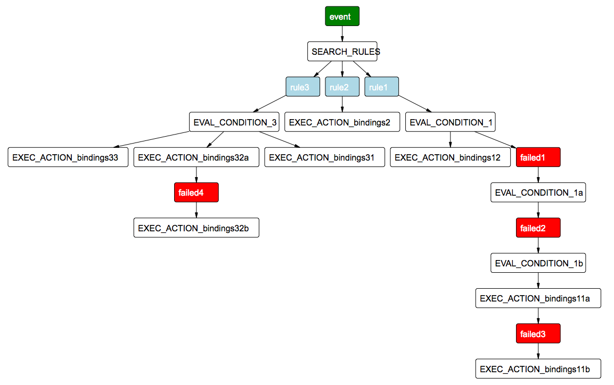
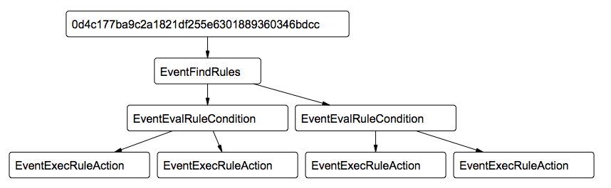

<!--

Copyright 2015 Comcast Cable Communications Management, LLC

Licensed under the Apache License, Version 2.0 (the "License");
you may not use this file except in compliance with the License.
You may obtain a copy of the License at

  http://www.apache.org/licenses/LICENSE-2.0

Unless required by applicable law or agreed to in writing, software
distributed under the License is distributed on an "AS IS" BASIS,
WITHOUT WARRANTIES OR CONDITIONS OF ANY KIND, either express or implied.
See the License for the specific language governing permissions and
limitations under the License.

End Copyright -->


# Introduction

These notes summarize the design of the rules core.

See the [Manual](Manual.md) for system documentation.  You should be
familiar with the core concepts described in the manual.

# Functional summary


The rules core has a pretty simple API.  Basically:

1. Add and delete rules.
2. Add and delete facts (if you need them).
3. Ingest events.

Processing events is the goal.  Here's the the flow for an incoming
event:

1. Find relevant rules.
2. For each rule, evaluate the rule's condition.
3. For each set of bindings that satisfies the rule's condition, execute the rule's action.

As we discuss below, each rule, fact, and event is associated with
exactly one logical location.

# Flow

Here's a diagram of example event processing




Here's a diagram of some actual processing:




# Basic design

The rules core is presented as a library that provides the APIs above.
This library is capable of supporting multiple logical locations.  In
a typical use, a UNIX process wraps that library (with HTTP, ZeroMQ,
dequeuers, whatever) to provide the library functionality to the
application at large.  How operations and events get to the right
process is up to that process and the other process that talk to it.
The core library doesn't do any routing.


# Processing

## 1. Find relevant rules

Given an event, we want to find all rules with `when` patterns that
match the event.  We also need the sets of variable bindings from each
match.  We write "bindingss" to mean a set of bindings.

> *event* &rarr; < *rule* , *bindingss* >*

In order to obtain those rules and associated sets of bindings, we
first find rules that might match the event.  We need to make sure we
don't miss any rules with `when` patterns that match the event, but we
can stand to find some rules that end up not matching.

> *event* &rarr; *rule**

As we find rules, we perform the match to give bindingss (if any):

> *rule* &rarr; *bindings**

Please review the [matching](Manual.md#matching) for details about the
supported matching.

A key index performance metric is the ratio of the number of matching
rules to the number of candidate rules.  We want that ratio to be
close to 1 and far from 0.

The search for rules is a little interesting.  In spirit, we are given
data (the event), and we need to find queries (the rules' `when`
patterns) that fit that data.  This task is the opposite of what
standard databases do.

The current implementation uses an in-memory data structure that is
similar to a write-through cache for persistence.  When a new rule is
added, this in-memory data structure is modified, and the change is updated in provide persistence.  Using this in-memory approach means
that we can find rules relatively fast at the obvious cost of doing
serious capacity planning.

The current algorithm operates on a tree-based index.

When a rule's `when` pattern is indexed, the pattern is traversed in a
manner similar to that for [suffix
trees](http://en.wikipedia.org/wiki/Suffix_tree).  When at a map value
(including the root), the property-value pairs are ordered based on
lexicographical ordering.

For example, the map

```Javascript
{"c":{"e":"E"}, "d":"D", "a":{"b":"?B"}}
```

for a rule given an ID *i* is processed as branch:

```
1    a
2      <MAP>
3        b
4          <VAR>
5            c
6              <MAP>
7                e
8                  E
9                    d
10                      D
11                        <IDS>
11                          -> i
```

Variables are replaced by a single special token `<VAR>` and map
values are marked with a special token `<MAP>`.

The algorithm for adding a pattern at an ID to the index is basically
overlaying the pattern's branch on the existing tree.  Then add the ID
at the `<IDS>` leaf.

Removing a pattern can be as simple as following the pattern's branch
to the `<IDS>` and then removing the ID from that set of IDs.
Additional, the algorithm should perform some garbage collection to
trim the branch below which IDs no longer exist.

Examples:

```Shell
# See `core/patternindex_test.go`:
go test -v -test.run=PatternIndex
```

Add a rule with `when` pattern `{"a":"A"}`.  We'll give this rule the
ID `paA`.

```
1    a
2      A
3        <IDS>
3        -> paA
```

The notation above represents a map:

> `a` &rarr; `A` &rarr; `<IDS>` &rarr; `paA`

The special `<IDS>` represents a set of rule IDs.  In this example,
that set is the singleton containing the ID `paA`.

Now add `{"a":"B"}` with ID `pbB`:

```
1    a
2      A
3        <IDS>
3        -> paA
1    b
2      B
3        <IDS>
3        -> pbB
```

More:

`{"a":"A", "b": "B"}` at `paAbB`:

```
1    a
2      A
3        <IDS>
3        -> paA
3        b
4          B
5            <IDS>
5            -> paAbB
1    b
2      B
3        <IDS>
3        -> pbB
```

`{"b":"B","c":"C"}` at `pbBcC`:

```
1    a
2      A
3        <IDS>
3        -> paA
3        b
4          B
5            <IDS>
5            -> paAbB
1    b
2      B
3        <IDS>
3        -> pbB
3        c
4          C
5            <IDS>
5            -> pbBcC
```

And now four more:

1. `{"a":{"x":"X"}}` at `paxX`
2. `{"a":{"x":"X","y":"Y"}}` at `paxXyY`
3. `{"a":{"y":"Y"}}` at `payY`
4. `{"a":"?A","b":"B"}`  at `pa?bB`

```
1    a
2      A
3        <IDS>
3        -> paA
3        b
4          B
5            <IDS>
5            -> paAbB
2      <MAP>
3        x
4          X
5            <IDS>
5            -> paxX
5            y
6              Y
7                <IDS>
7                -> paxXyY
3        y
4          Y
5            <IDS>
5            -> payY
2      <VAR>
3        b
4          B
5            <IDS>
5            -> pa?bB
1    b
2      B
3        <IDS>
3        -> pbB
3        c
4          C
5            <IDS>
5            -> pbBcC
```

When given an event, we search the index by traversing the event
pattern and the rule index in a similar matter.  Since (at a given
level of the structure) an event can contain a superset of a rule's
`when` pattern's properties, we have perform something similar to
backtracking as we go.

The current implementation does not support patterns with property
variables.   For example, the pattern

```Javascript
{"a":123,"?X":456}
```

should be rejected because "?X" is a property variable (not a value
variable).  If you think you want property variables, reconsider your
[knowledge representation](#knowledge-representation).  Or implement a
fancier index.


## 2. Rule condition evaluation

A rule condition is optional.  If present, it can include `and`s,
`or`s, and `not`s as you would expect.  The primitive components are
either fact patterns or arbitrary (Javascript) code.

### Fact patterns

Consider the fact pattern

```Javascript
{"likes":"?x", "at":"?place"}
```

That pattern will seek bindings for what is liked at what places.
More generally, when in a rule `condition`, this pattern generates a
match attempt of the local fact datastore (at the rule's location).

The local fact datastore is an in-memory structure that also stores in provide persistence.  The primary function of this fact
datastore is to index ephemeral facts that are useful for many type of
rules.  Example uses: counters, cached state, other state not stored
externally.

The current index implementation is fairly simplistic.  When a fact is
added, the facts terms (atomic values) are extracted and stored in an
inverted index.  When presented with a pattern (the query), the fact
datastore finds candidate facts.  Each candidate fact is matched
against the pattern.  The result is zero (in the case of no match) or
more (in the case of at least one match) sets of bindings.

Various heuristics are useful to avoid indexing dumb, costly values.
For example, values might include large chunks of text that are never
used in matching.  Rather than store a long, never-matched value, we
can drop it.  See `StringLengthTermLimit` in the code.

A key index performance metric is the ratio of the number of matching
facts to the number of candidate facts returned by the index.  We want
that ratio to be close to 1 and far from 0.

### External fact services

If the fact pattern includes a string-valued `location` property that
starts with `http:` or `https:`, then that location is interpreted as
the URL for a fact service endpoint.  In this case, the fact search is
sent to that endpoint.


### Code

A rule's condition can include `code`.  For example:

```Javascript
{"code":"0 < n"}
```

would test that a binding for `n` was greater than zero.

Currently, the code is executed as in-process Javascript.  In
particular, the current implementation is
[`robertkrimen/otto`](https://github.com/robertkrimen/otto); however,
we might eventually use [`v8.go`](https://github.com/idada/v8.go)
instead.  Obviously, it'd be easy to support other languages via a
`language` property.


### Query plans

Since a rule's `condition` can make use of `and`s, `or`s, and `not`s,
you might think that a clever query planner orders the constituent
searches in a near-optimal plan.  At the moment, you would be wrong.
Currently, the query plan is simply given by the structure of the
`condition` itself.  As a consequence, `condition` authors should
order conjuncts, disjuncts, and negations is a manner that should
result is exploration of relatively small search space.

Here's how a query planner could operate:

> For each pattern, request an estimate of the number of matching
> facts.  Since obtaining matching facts is a two-step process (find
> candidate facts and then attempt matches on each), we can find a
> natural estimate after the first step -- possibly informed by
> historical ratios of candidates to matches.  More generally, get
> estimates of required effort.  Issue these requests for these
> estimates in parallel.  The plan will start with the query that has
> a low (perhaps lowest) estimated effort.  The next query (actually
> queries), based on sets of bindings returned from the first query,
> should have the next lowest effort based on the initial estimates.

> As a further optimization, as bindings arrive from queries, we can
> update our estimates of require query effort.  In general, we update
> our beliefs about query effort based on the bindings obtained in
> previous queries.  Getting updated estimates can be relatively
> simple since we can just replace bound variables in the candidate
> queries.


## 3. Executing rule actions

Currently, the code with `endpoint:javascript` is executed as
in-process Javascript.  In particular, the current implementation is
[`robertkrimen/otto`](https://github.com/robertkrimen/otto); however,
we might eventually use [`v8.go`](https://github.com/idada/v8.go)
instead.

If the code map includes a `endpoint` value, then that value is
resolved to a URL via `GroupConfig.Services`.  If resolution
fails, then the value itself should either be URL or `javascript`.  A
URL should point to an action executor.  `javascript` means to use an
in-process Javascript interpreter.

An action executor can obviously do just about anything.  Some
deployments might want a queue system interface to action executors.
That way action execution workers could be scaled elastically.


# Logical locations and scalability

Any horizontally scalable system needs to be able to route operations
to a small subset of nodes.  The rules core uses "logical locations"
for this purpose.

Each rule, fact, and event is associated with exactly one logical
location.

A given rules core UNIX process will typically provide service for
several thousand or more many more logical locations.  Gear above the
process should make sure that an operation for a given location gets
to the right place.  Exactly how is another discussion altogether.
See the manual and other documention for more on this topic.


# API protocols

The core APIs (see above) are pretty simple.  They should be easily
presented via HTTP, ZeroMQ, Nanomsg, Kafka or SQS messages, or any
other protocol.  See `service/httpd.go` and `service/service.go` for
examples.


# Miscellaneous topics

## Persistence

As we discussed above, both the fact index and rule index store can
write the underlying data externally.  See `core/state.go` and
`core/storage.go`.  See `storage/` for some implementations.


## Logging

TBD.

## Knowledge representation

For decent performance, good knowledge representation is critical.
Unfortunately, we don't have a concise set of guidelines.

Typically allowing user-provided data to creep into property names
causes trouble.  Property names are usually best considered as struct
fields, not data.

Also consider the usual trade-offs related to (de)normalization.  For
example, when you think you want to do

```Javascript
{"when":{"pattern":{"measured":"?x","device":"?dev"}},
 "condition":{"pattern":{"dev":"?dev","units":"meters"}},
 ...}
```

consider denormalizing:

```Javascript
{"when":{"pattern":{"measured":"?x", "device":"?dev", "units":"meters"}},
 ...}
```

Bottom line: Test performance and other resource consumption.


## Robustness

The current library should do more to protect itself.  Examples:

1. Optional timeouts (perhaps will automatic retries after back-offs)
   for all calls to external services.  Prime candidates: External
   fact services and action executors.

2. Implicit or explicit input (events, operations) throttling.  One
   approach is to obtain events using one or more dequeuer threads.

3. Circuit breakers.  For when rules and events go wrong.

4. Better resource limit specifications.  Since two key indexes (for
   facts and rules) are in-memory structures, capacity planning is
   critical.  The core library has some support for specifying limits
   on the maximum numbers of rules and and facts per location.  This
   support should probably be expanded to consider memory footprint in
   addition to object counts.  (Two facts can obviously have very
   different footprints.)


## Testing

Always test performance in realistic situations.  Rules really end up
as code (both as condition evaluation and action execution) and should
be treated as such to the extent possible (with circuit breakers,
etc., as additional protection).


